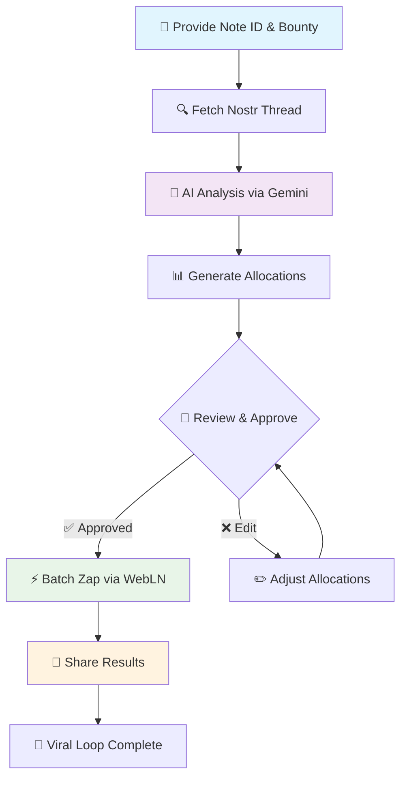

# Glow: The AI Bounty Allocator

**An AI-powered YakiHonne mini-app that turns scattered zaps into strategic rewards. Glow analyzes conversations and distributes bounties to valuable contributors, not random noise.**


## 🎯 Core Philosophy

Glow is built on three fundamental beliefs:

1. **Likes are worthless metrics** — They measure fleeting popularity, not true value, creating a hollow engagement economy
2. **Substance deserves reward** — Key contributors provide the most value in conversations and should be economically recognized
3. **Value should be frictionless** — Rewarding quality should be as easy as creating it

Glow is our solution: an AI-powered value engine using Google's Gemini AI to analyze Nostr threads, identify valuable contributors, and help you reward them with Bitcoin sats. It's designed to supercharge the "zap" economy on platforms like YakiHonne while eliminating vanity metrics.

## 🔥 The Problem We're Solving

Current social media models create critical issues:

- **Valuable content gets buried** — Insightful comments are lost in noise without economic recognition
- **Tipping is inefficient** — Manual tipping creates friction that discourages community rewards
- **Incentives are misaligned** — Systems reward the loudest voices, not the most insightful ones

Glow fixes this by programmatically linking economic value to intellectual substance.

## ✨ Key Features

### 🧠 AI-Powered Value Analysis
Glow doesn't just count replies—it understands them. Using Google Gemini AI, it performs nuanced conversation analysis to identify replies that provide the most insight, constructive feedback, or critical information. It measures merit over presence and provides transparent justifications.

### 💰 Community Bounty Distribution
Replace inefficient 1-to-1 tips with community-scale rewards. Post a single "bounty" for an entire thread, and let AI recommend how to split it among worthy contributors. Transform tipping from personal gestures into community-building events.

### 🎛️ Total User Control
AI acts as your trusted advisor, not dictator. Review recommendations in a clear interface, adjust sat amounts, add or remove recipients, and fine-tune results before any payment. Human oversight guides AI analysis.

### ⚡ Frictionless Batch Zaps
Leveraging WebLN standard, Glow constructs single batch transactions to pay all recipients at once. Transform multiple zaps into one seamless click—making community rewards as easy as liking a post.

### 📈 Engineered Viral Growth
After successful distribution, the app generates pre-filled Nostr notes for sharing. These notes @-mention recipients (driving engagement), announce bounty amounts (social proof), and link back to the app—turning every use case into authentic marketing.

## 🔄 How It Works: The Value Funnel

Complete the entire workflow in under 60 seconds:



### Step-by-Step Process:

1. **Initiate** — Paste a Nostr note ID and set total bounty in sats
2. **Analyze** — Glow fetches the conversation and sends it to Gemini AI for analysis
3. **Review** — AI returns ranked contributors with recommended sat allocations
4. **Approve** — Review suggestions, make edits, and approve batch payment
5. **Distribute** — Single click sends zaps to all recipients via WebLN
6. **Amplify** — Share results to create viral growth loop

## 🏗️ Technical Architecture

### Core Components

#### `BountyAllocator.tsx`
Primary React component orchestrating the entire UI and workflow. Manages application state transitions from input form → analysis → recommendations → success state.

#### `nostrService.ts`
Dedicated module for Nostr network communication. Handles relay connections, event subscriptions, and conversation thread fetching. Provides clean data to the application.

#### `geminiService.ts`
Encapsulates Google Gemini API logic. Takes raw text from `nostrService`, formats engineered prompts, sends API requests, and parses JSON responses for `BountyAllocator`.

### AI Prompt Engineering

Quality output requires quality prompts. We use structured prompts instructing Gemini to act as an impartial analyst returning specific JSON schemas:

```javascript
const prompt = `
System: You are an AI assistant analyzing a Nostr thread to determine who provided the most value. Your goal is to recommend a fair allocation of a Bitcoin sats bounty.

Analyze the following conversation:
---
${formattedConversation}
---

Rules:
1. Identify the top 5 most valuable contributors
2. Provide brief justification for each (max 10 words)
3. Return ONLY valid JSON array with: pubkey, justification, percentage
4. All percentage values must sum to 100

Response format:
[
  {
    "pubkey": "npub...",
    "justification": "Provided key insight",
    "percentage": 40
  }
]
`;
```

## 🚀 Getting Started

### Prerequisites
- Node.js 16+ installed
- Google Gemini API key ([Get yours here](https://aistudio.google.com/app/apikey))
- WebLN-compatible Lightning wallet

### Installation

1. **Clone the repository:**
   ```bash
   git clone https://github.com/OkeyAmy/sats-allocator.git
   cd sats-allocator
   ```

2. **Install dependencies:**
   ```bash
   npm install
   ```

3. **Start development server:**
   ```bash
   npm run dev
   ```
   
   Server typically runs at `http://localhost:8080`

4. **Configure API key:**
   The app will prompt for your Gemini API key on first use.

### Build for Production

```bash
npm run build
npm run preview
```

## 🔒 Security & Privacy

Security and privacy are non-negotiable:

- **🌐 Fully Client-Side** — Operates entirely in your browser with no backend server
- **🔐 Non-Custodial** — Uses WebLN to interact with *your* Lightning wallet—keys never leave your control
- **🗂️ Secure Storage** — Gemini API key stored in `sessionStorage` only—automatically deleted when tab closes
- **🚫 Zero Data Collection** — We never access, store, or transmit your personal data

## 🤝 Contributing

Help us build a new economic model for the internet!

1. Fork the repository
2. Create feature branch (`git checkout -b feature/AmazingFeature`)
3. Commit changes (`git commit -m 'Add AmazingFeature'`)
4. Push to branch (`git push origin feature/AmazingFeature`)
5. Open Pull Request

### Development Guidelines

- Follow existing code style and patterns
- Add tests for new features
- Update documentation for API changes
- Ensure all security practices are maintained

## 📜 License

This project is licensed under the MIT License - see the [LICENSE](LICENSE) file for details.

## 🙏 Acknowledgments

- Google Gemini AI for intelligent conversation analysis
- Nostr protocol for decentralized social networking
- WebLN standard for seamless Lightning payments
- Open source community for inspiration and support

## 📞 Support

- 🐛 [Report Issues](https://github.com/OkeyAmy/sats-allocator/issues)
- 💬 [Discussions](https://github.com/OkeyAmy/sats-allocator/discussions)
- 📧 Contact: [https://x.com/okey_amy]

---

*Built with ❤️ for the Bitcoin and Nostr communities*
