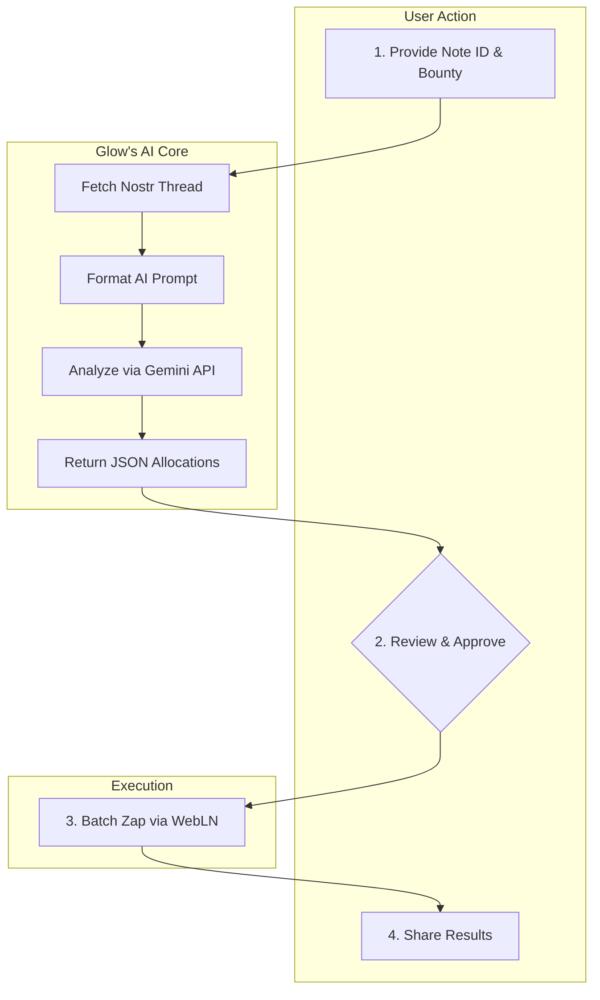

# Glow: The AI Bounty Allocator

**An AI-powered Nostr mini-app to replace worthless likes with Bitcoin zaps. It analyzes conversations and rewards value, not noise. 🤖⚡️**


## Core Philosophy

Glow is built on a few core beliefs:
1.  **Likes are a worthless metric.** They measure fleeting popularity, not true value, and have created a hollow economy.
2.  **Substance deserves reward.** In any conversation, a few key contributors provide the most value. This value should be recognized and rewarded economically.
3.  **Value should be frictionless.** The process of rewarding quality should be as easy as the process of creating it.

Glow is our weapon to enforce these beliefs. It's an AI-powered value engine that uses Google's Gemini AI to analyze Nostr threads, identify the most valuable contributors, and help you reward them with Bitcoin sats. It's designed to supercharge the "zap" economy on platforms like YakiHonne and kill the empty game of vanity metrics.

## The Problem It Solves

The current social media model is broken. It creates several critical issues:

-   **Valuable Content is Buried:** In any active thread, insightful comments are lost in a sea of noise, receiving no economic recognition.
-   **Tipping is Inefficient:** Manually tipping every valuable contributor is a high-friction process that discourages the act of rewarding a community.
-   **Incentives are Misaligned:** The current model rewards the loudest and most frequent voices, not the most insightful ones, leading to a race to the bottom for attention.

Glow was built to fix this by programmatically linking economic value to intellectual substance.

## Key Features in Detail

-   **AI-Powered Value Analysis**
    Glow doesn't just count replies; it understands them. It uses the Google Gemini AI to perform a nuanced analysis of an entire conversation, identifying the specific replies that provided the most insight, constructive feedback, or critical information. It measures merit, not just presence, and provides a justification for its choices, ensuring transparency.

-   **Community Bounty Distribution**
    Instead of inefficient 1-to-1 tips, Glow allows a user to post a single "bounty" for an entire thread. The AI then recommends how to split that bounty among all the worthy contributors. This allows for community-scale economic rewards, transforming the act of tipping from a personal gesture into a community-building event.

-   **Total User Control**
    The AI acts as a trusted advisor, not a dictator. Glow presents its recommendations in a clear interface, but the user has final authority. You can adjust sats amounts, add or remove recipients, and fine-tune the results before any payment is sent. This ensures the AI's objective analysis is guided by and accountable to human oversight.

-   **Frictionless Batch Zaps**
    Leveraging the WebLN standard, Glow constructs a single batch transaction to pay all recipients at once. This transforms the cumbersome process of sending multiple zaps into a single, seamless click, making the act of rewarding an entire community as easy as liking a single post.

-   **Engineered Viral Growth Loop**
    After a bounty is successfully distributed, the app generates a pre-filled Nostr note for sharing. This note is designed for virality: it @-mentions the recipients (driving engagement and notifying them of their reward), announces the bounty amount (social proof), and links back to the app, turning every successful use case into a powerful, authentic marketing event.

## How It Works: The Value Funnel

The user workflow is a simple, powerful loop designed to be completed in under 60 seconds.



1.  **Initiate:** A user pastes a Nostr note ID and sets a total bounty in sats.
2.  **Analyze:** Glow fetches the entire conversation and sends it to the Gemini AI for analysis. The AI returns a ranked list of contributors and recommended sats allocations.
3.  **Approve:** The user reviews the AI's suggestions, makes any desired edits, and approves the batch payment.
4.  **Distribute:** With a single click, Glow uses WebLN to send the zaps to all recipients.
5.  **Amplify:** The app encourages the user to share the results, creating a viral loop that brings in the next wave of users.

## Technical Deep Dive

### Core Architecture

-   **`BountyAllocator.tsx`**: The primary React component that orchestrates the entire UI and user workflow. It manages the application's state, transitioning from the initial input form, through the loading and analysis phase, to the recommendation screen, and finally to the success state.
-   **`nostrService.ts`**: A dedicated module responsible for all communication with the Nostr network. It handles connecting to a list of public relays, subscribing to events, and fetching an entire conversation thread based on a root note ID. Its sole job is to provide clean data to the rest of the application.
-   **`geminiService.ts`**: This module encapsulates all logic for interacting with the Google Gemini API. It takes the raw text from `nostrService`, formats it into a carefully engineered prompt, sends the request to the API, and then parses the resulting JSON response to be used by the `BountyAllocator` component.

### AI Prompt Engineering

The quality of the AI's output is determined by the quality of the prompt. We use a structured prompt that instructs the Gemini model to act as an impartial analyst and return a specific JSON schema.

**Example Prompt Structure:**

```
System: You are an AI assistant analyzing a Nostr thread to determine who provided the most value. Your goal is to recommend a fair allocation of a Bitcoin sats bounty.

Analyze the following conversation:
---
[Formatted conversation data, including user pubkeys and reply content]
---

Rules:
1. Identify the top 5 most valuable contributors.
2. For each contributor, provide a brief justification (max 10 words).
3. Return ONLY a valid JSON array of objects with the fields: `pubkey`, `justification`, `percentage`.
4. The sum of all `percentage` values must equal 100.
```

## Getting Started

1.  **Clone the repository:**
    ```sh
    git clone https://github.com/OkeyAmy/sats-allocator.git
    cd sats-allocator
    ```

2.  **Install dependencies:**
    ```sh
    npm install
    ```

3.  **Set up your environment:**
    This application requires a Google Gemini API key.
    -   You can get your key from [Google AI Studio](https://aistudio.google.com/app/apikey).
    -   The app will prompt you to enter this key on first use.

4.  **Run the development server:**
    ```sh
    npm run dev
    ```
    This will start the development server, typically at `http://localhost:8080`.

## Security & Privacy by Design

Security and user privacy are non-negotiable.
-   **Fully Client-Side:** Glow operates entirely within your browser. There is no backend server, which means we never have access to your data.
-   **Non-Custodial:** The app uses WebLN to interact with your *own* Lightning wallet. Your keys and your sats never leave your control.
-   **Secure API Key Storage:** Your Gemini API key is stored exclusively in the browser's `sessionStorage`. This means it is automatically deleted when you close the browser tab, providing a secure balance between convenience and privacy.

## Contributing

Contributions are welcome! This project is about building a new economic model for the internet.

1.  Fork the repository.
2.  Create your feature branch (`git checkout -b feature/AmazingFeature`).
3.  Commit your changes (`git commit -m 'Add some AmazingFeature'`).
4.  Push to the branch (`git push origin feature/AmazingFeature`).
5.  Open a Pull Request.
