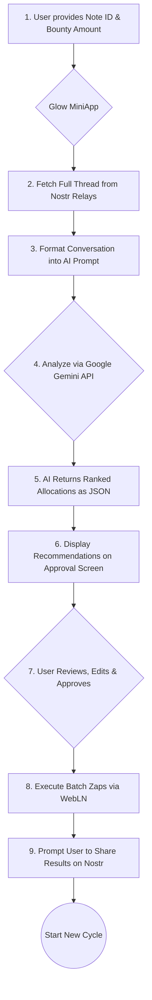

# Glow: The AI Bounty Allocator

**Vision:** To make the 'like' button worthless by making real value, measured in Bitcoin zaps, the only game in town.


Glow is a wrecking ball for the meaningless metrics of social media. It's an AI-powered value engine built as a Nostr MiniApp, designed to work on platforms like YakiHonne. It hijacks native "zap" functionality—transforming it from a simple tip jar into a tool for rewarding whole communities. It uses AI to sidestep popularity contests and funnel sats directly to people with good ideas, turning conversations into meritocracies where substance actually pays.

## The Problem: The Empty Game of Vanity Metrics

For too long, the internet has run on a lie: that likes and retweets are a proxy for value. They are not. This system creates several critical issues:

-   **Valuable Content is Buried:** In any active thread, insightful comments are lost in a sea of noise, receiving no economic recognition.
-   **Tipping is Inefficient:** Manually tipping every valuable contributor is a high-friction process that discourages the act of rewarding a community.
-   **Incentives are Broken:** The current model rewards the loudest and most frequent voices, not the most insightful ones, leading to a race to the bottom for attention.

Glow was built to break this game by programmatically linking value to substance.

## Key Features

-   **AI-Powered Value Analysis:** Glow doesn't just count replies; it understands them. It uses the Google Gemini AI to perform a nuanced analysis of an entire conversation, identifying the specific replies that provided the most insight, constructive feedback, or critical information. It measures merit, not just presence.

-   **Community Bounty Distribution:** Instead of inefficient 1-to-1 tips, Glow allows a user to post a single "bounty" for an entire thread. The AI then recommends how to split that bounty among all the worthy contributors, allowing for community-scale economic rewards.

-   **Total User Control:** The AI acts as a trusted advisor, not a dictator. Glow presents its recommendations in a clear interface, but the user has final authority. You can adjust sats amounts, add or remove recipients, and fine-tune the results before any payment is sent, ensuring the AI's objective analysis is guided by human oversight.

-   **Frictionless Batch Zaps:** Leveraging WebLN, Glow constructs a single batch transaction to pay all recipients at once. This transforms the cumbersome process of sending multiple zaps into a single, seamless click, making the act of rewarding an entire community as easy as liking a single post.

-   **Engineered Viral Growth Loop:** After a bounty is successfully distributed, the app generates a pre-filled Nostr note for sharing. This note is designed for virality: it @-mentions the recipients (driving engagement), announces the bounty (social proof), and links back to the app, turning every successful use case into a powerful, authentic marketing event.

## How It Works: The Value Funnel


The workflow is a simple, powerful loop: a user initiates a bounty, the AI analyzes the conversation and suggests a fair allocation, the user approves (or edits) the allocation, and a batch of zaps are sent. The final, crucial step prompts the user to share the results, which in turn acquires the next wave of users.

## Technology Rationale

The tech stack was chosen for speed, reliability, and a modern development experience.

-   **Framework**: **React** with **Vite** provides a fast, responsive, and highly efficient development environment, perfect for a snappy and interactive single-page application.
-   **Language**: **TypeScript** ensures type safety, making the code more robust, predictable, and easier to maintain, which is critical when dealing with financial transactions.
-   **UI**: **Tailwind CSS** and **shadcn-ui** allow for rapid development of a modern, clean, and fully responsive user interface without sacrificing customizability.
-   **Nostr**: The **`nostr-tools`** library is the gold standard for interacting with the Nostr protocol, providing a reliable foundation for fetching thread data.
-   **AI**: The **Google Gemini** API was chosen for its large context window and strong instruction-following capabilities, which are essential for analyzing long conversation threads and returning structured JSON data.
-   **Payments**: **WebLN** is the universal standard for web-based Bitcoin Lightning payments, allowing Glow to interact with a user's preferred wallet in a non-custodial and secure manner.

## Core Architecture

-   `BountyAllocator.tsx`: The main React component that orchestrates the entire UI and user workflow, managing state from input to final success screen.
-   `nostrService.ts`: A dedicated module responsible for all communication with the Nostr network. It handles connecting to relays and fetching entire conversation threads based on a root note ID.
-   `geminiService.ts`: This module encapsulates all logic for interacting with the Google Gemini API. It formats the prompt from the Nostr data and processes the AI's JSON response.

## Getting Started

To run Glow locally, follow these steps:

1.  **Clone the repository:**
    ```sh
    git clone https://github.com/OkeyAmy/sats-allocator.git
    cd glow-sats-allocator
    ```

2.  **Install dependencies:**
    ```sh
    npm install
    ```

3.  **Set up your environment:**
    This application requires a Google Gemini API key.
    -   You can get your key from [Google AI Studio](https://aistudio.google.com/app/apikey).
    -   The app will prompt you to enter this key on first use.

4.  **Run the development server:**
    ```sh
    npm run dev
    ```
    This will start the development server, typically at `http://localhost:5173`.

## Security & Privacy by Design

Security and user privacy are non-negotiable.
-   **Fully Client-Side:** Glow operates entirely within your browser. There is no backend server, which means we never have access to your data.
-   **Non-Custodial:** The app uses WebLN to interact with your *own* Lightning wallet. Your keys and your sats never leave your control.
-   **Secure API Key Storage:** Your Gemini API key is stored exclusively in the browser's `sessionStorage`. This means it is automatically deleted when you close the browser tab, providing a secure balance between convenience and privacy.

## Contributing

Contributions are welcome! This project is about building a new economic model for the internet.

1.  Fork the repository.
2.  Create your feature branch (`git checkout -b feature/AmazingFeature`).
3.  Commit your changes (`git commit -m 'Add some AmazingFeature'`).
4.  Push to the branch (`git push origin feature/AmazingFeature`).
5.  Open a Pull Request.
