# Glow: The AI Bounty Allocator

**An AI-powered YakiHonne mini-app that turns scattered zaps into strategic rewards. Glow analyzes conversations and distributes bounties to valuable contributors, not random noise.**


## 🎯 Core Philosophy

Glow is built on three fundamental beliefs:

1. **Likes are worthless metrics** — They measure fleeting popularity, not true value, creating a hollow engagement economy
2. **Substance deserves reward** — Key contributors provide the most value in conversations and should be economically recognized
3. **Value should be frictionless** — Rewarding quality should be as easy as creating it

Glow is our solution: an AI-powered value engine using Google's Gemini AI to analyze Nostr threads, identify valuable contributors, and help you reward them with Bitcoin sats. It's designed to supercharge the "zap" economy on platforms like YakiHonne while eliminating vanity metrics.

## 🔥 The Problem We're Solving

Current social media models create critical issues:

- **Valuable content gets buried** — Insightful comments are lost in noise without economic recognition
- **Tipping is inefficient** — Manual tipping creates friction that discourages community rewards
- **Incentives are misaligned** — Systems reward the loudest voices, not the most insightful ones

Glow fixes this by programmatically linking economic value to intellectual substance.

## ✨ Key Features

### 🧠 AI-Powered Value Analysis
Glow doesn't just count replies—it understands them. Using Google Gemini AI, it performs nuanced conversation analysis to identify replies that provide the most insight, constructive feedback, or critical information. It measures merit over presence and provides transparent justifications.

### 💰 Community Bounty Distribution
Replace inefficient 1-to-1 tips with community-scale rewards. Post a single "bounty" for an entire thread, and let AI recommend how to split it among worthy contributors. Transform tipping from personal gestures into community-building events.

### 🎛️ Total User Control
AI acts as your trusted advisor, not dictator. Review recommendations in a clear interface, adjust sat amounts, add or remove recipients, and fine-tune results before any payment. Human oversight guides AI analysis.

### ⚡ Frictionless Batch Zaps
Leveraging WebLN standard, Glow constructs single batch transactions to pay all recipients at once. Transform multiple zaps into one seamless click—making community rewards as easy as liking a post.

### 📈 Engineered Viral Growth
After successful distribution, the app generates pre-filled Nostr notes for sharing. These notes @-mention recipients (driving engagement), announce bounty amounts (social proof), and link back to the app—turning every use case into authentic marketing.

## 🔄 How It Works: The Value Funnel

Complete the entire workflow in under 60 seconds:

```mermaid
flowchart TD
    A[🎯 Provide Note ID & Bounty] --> B[🔍 Fetch Nostr Thread]
    B --> C[🤖 AI Analysis via Gemini]
    C --> D[📊 Generate Allocations]
    D --> E{👤 Review & Approve}
    E -->|✅ Approved| F[⚡ Batch Zap via WebLN]
    E -->|❌ Edit| G[✏️ Adjust Allocations]
    G --> E
    F --> H[📢 Share Results]
    H --> I[🔁 Viral Loop Complete]
    
    style A fill:#e1f5fe
    style C fill:#f3e5f5
    style F fill:#e8f5e8
    style H fill:#fff3e0
```



### Step-by-Step Process:

1. **Initiate** — Paste a Nostr note ID and set total bounty in sats
2. **Analyze** — Glow fetches the conversation and sends it to Gemini AI for analysis
3. **Review** — AI returns ranked contributors with recommended sat allocations
4. **Approve** — Review suggestions, make edits, and approve batch payment
5. **Distribute** — Single click sends zaps to all recipients via WebLN
6. **Amplify** — Share results to create viral growth loop

## 🏗️ Technical Architecture

### Core Components

#### `BountyAllocator.tsx`
Primary React component orchestrating the entire UI and workflow. Manages application state transitions from input form → analysis → recommendations → success state.

#### `nostrService.ts`
Dedicated module for Nostr network communication. Handles relay connections, event subscriptions, and conversation thread fetching. Provides clean data to the application.

#### `geminiService.ts`
Encapsulates Google Gemini API logic. Takes raw text from `nostrService`, formats engineered prompts, sends API requests, and parses JSON responses for `BountyAllocator`.

### AI Prompt Engineering

The system prompt is optimized for high-precision, JSON-only answers and now asks the AI to return an optional `replyId` for each selected contributor. This lets the UI render the exact original reply text chosen by the AI (no regenerated content). Key constraints:

- The AI must select only valuable replies based on substantive criteria (problem solving, novelty/insight, constructive argument, data provision).
- The AI returns contributors as JSON: `name`, `pubkey`, optional `replyId`, `contribution` (raw reply text or concise excerpt), `recommendedSats`, and `aiJustification`.
- The sum of `recommendedSats` must equal the total bounty.
- No extra prose outside JSON.

We also include for every reply in the prompt both `Pubkey` and `EventId` to make returning `replyId` reliable.

## 🚀 Getting Started

### Prerequisites
- Node.js 16+ installed
- Google Gemini API key ([Get yours here](https://aistudio.google.com/app/apikey))
- WebLN-compatible Lightning wallet

### Installation

1. **Clone the repository:**
   ```bash
   git clone https://github.com/OkeyAmy/sats-allocator.git
   cd sats-allocator
   ```

2. **Install dependencies:**
   We use pnpm for consistent installs.
   ```bash
   pnpm install
   ```

3. **Start development server:**
   ```bash
   pnpm dev
   ```
   
   Server typically runs at `http://localhost:8080`

4. **Configure API key:**
   The app will prompt for your Gemini API key on first use.

### Build for Production

```bash
pnpm build
pnpm preview
```

## 🧩 Supported Nostr Identifiers

You can input multiple Nostr identifier formats; the app will decode and resolve them:

- `note1...` (nevent for events by id)
- `nevent1...` (event with embedded relays; we resolve the root when the id is a reply)
- `naddr1...` (addressed events; we infer the event id or use identifier + relays)
- 64-char hex ids

If a provided identifier points to a reply, we resolve and fetch the thread from the root event, then include direct and one-level nested replies. Replies are deduplicated across relays.

## 🧱 System Architecture

```mermaid
flowchart LR
  UI[React UI\nBountyAllocator] -->|note id + bounty| NostrService
  NostrService -->|fetch original + replies| Relays[(Nostr Relays)]
  NostrService -->|formatThreadForAI\n(Pubkey + EventId)| GeminiService
  GeminiService -->|prompt + JSON response| GoogleAI[(Gemini API)]
  GoogleAI -->|contributors JSON| GeminiService
  GeminiService -->|contributors| UI
  UI -->|map contributors to replies| NostrService
  UI -->|display original reply text| User
  UI -->|batch pay via WebLN| Wallet[(Lightning Wallet)]
```

### Data Flow & Responsibilities

- `BountyAllocator` orchestrates app state and wires services to UI.
- `nostrService`
  - Decodes identifiers (`note1`, `nevent1`, `naddr1`, hex)
  - Resolves root for reply `nevent`s
  - Fetches replies (direct + nested), dedupes, fetches author profiles
  - Supplies `formatThreadForAI` including `Pubkey` and `EventId` per reply
- `geminiService`
  - Builds strict system prompt (JSON-only, totals must match)
  - Requests Gemini and parses JSON
  - Schema supports `replyId` so the exact original reply can be shown
- UI mapping
  - Prefer `replyId` to locate the reply event
  - Fallback: match by `pubkey` and content similarity
  - Always render original reply content; AI text is not re-used as content

## 🧪 Notes on Accuracy & Limits

- Relay availability varies; counts can differ across clients. We query multiple relays, dedupe events, and limit nested depth for performance. Depth/limits can be tuned if needed.
- If a thread still shows 0 replies for a known active post, ensure the id resolves to the root or provide the root `note1`/hex id for best results.

## 🔒 Security & Privacy

Security and privacy are non-negotiable:

- **🌐 Fully Client-Side** — Operates entirely in your browser with no backend server
- **🔐 Non-Custodial** — Uses WebLN to interact with *your* Lightning wallet—keys never leave your control
- **🗂️ Secure Storage** — Gemini API key stored in `sessionStorage` only—automatically deleted when tab closes
- **🚫 Zero Data Collection** — We never access, store, or transmit your personal data

## 🤝 Contributing

Help us build a new economic model for the internet!

1. Fork the repository
2. Create feature branch (`git checkout -b feature/AmazingFeature`)
3. Commit changes (`git commit -m 'Add AmazingFeature'`)
4. Push to branch (`git push origin feature/AmazingFeature`)
5. Open Pull Request

### Development Guidelines

- Follow existing code style and patterns
- Add tests for new features
- Update documentation for API changes
- Ensure all security practices are maintained

## 📜 License

This project is licensed under the MIT License - see the [LICENSE](LICENSE) file for details.

## 🙏 Acknowledgments

- Google Gemini AI for intelligent conversation analysis
- Nostr protocol for decentralized social networking
- WebLN standard for seamless Lightning payments
- Open source community for inspiration and support

## 📞 Support

- 🐛 [Report Issues](https://github.com/OkeyAmy/sats-allocator/issues)
- 💬 [Discussions](https://github.com/OkeyAmy/sats-allocator/discussions)
- 📧 Contact: [https://x.com/okey_amy]

---

*Built with ❤️ for the Bitcoin and Nostr communities*
